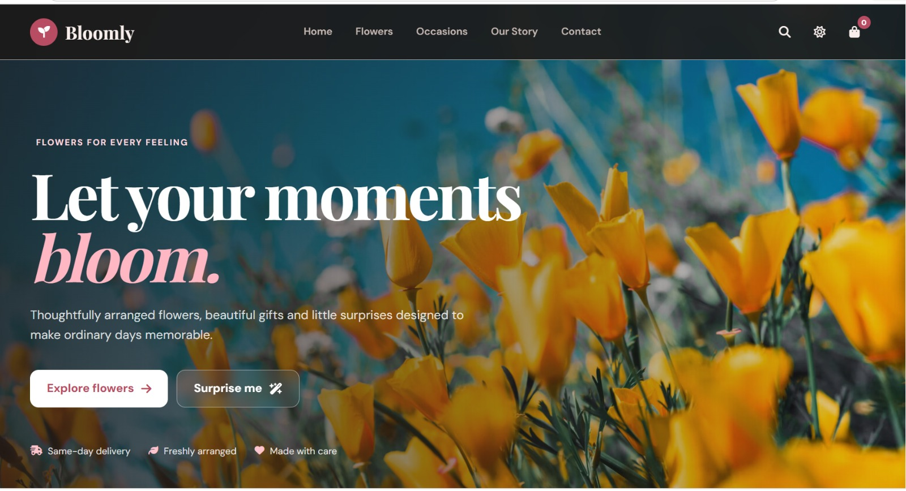
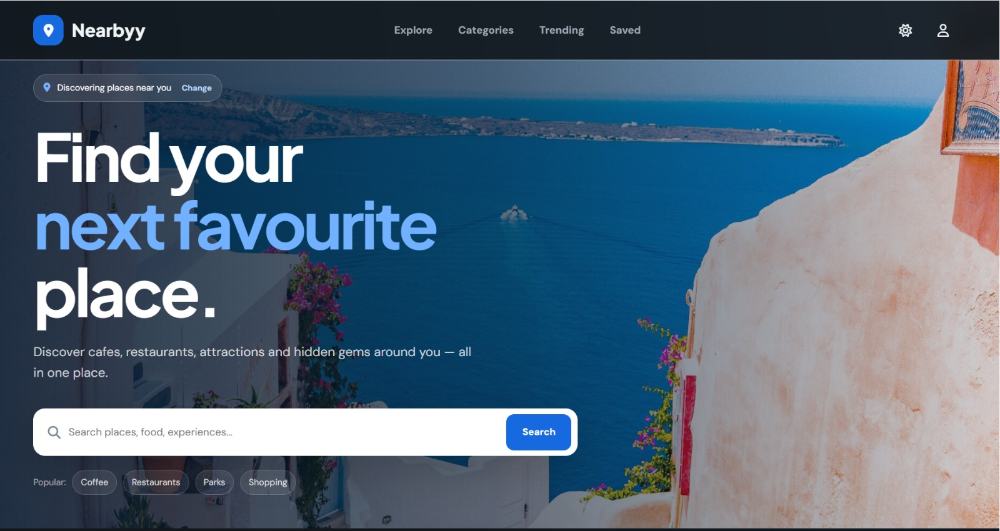

# Modern Web UI Templates

A collaborative collection of modern, responsive, and interactive web UI templates developed as part of our GitHub collaboration project.

The project demonstrates modern UI development using HTML, CSS, and JavaScript while following a complete GitHub collaboration workflow involving Fork, Clone, Branch, Commit, Push, Pull Request, Code Review, Approval, and Merge.

---
## 👥 Team Name
     
    Logic Legends

## 👥 Team Members

| Member | Hub | Contribution |
|---|---|---|
|B.Shanmukha Priya | Digital Lifestyle Hub | Pet Club, Polopan, Podcast Player, Stellerium Star Map |
|J.Prathyusha | Nature and Innovation Hub | Endangered Species Wildlife, Home AI, Adani One, Mythology Guide |
|V.Surya | Digital Safety Hub | Bloomly, Nearbyy, Privacy Display Guard, Spy Camera Detector |
|Ch.Manvitha Reddy | Frontier Tech Hub | Cure, Submarine Defense, Debate Arena, Alien Detector |
|B.SriMahi | Wellness Green Hub | Grow Plants, Soil Monitor, AI Resume Checker, Medication Reminder |

---

# 🎨 Selected UI Topic

## Modern Web Application Interfaces

Our project focuses on designing modern web application interfaces inspired by current digital products and emerging technology concepts.

The collection covers different areas including:

- Digital lifestyle
- Nature and innovation
- Digital safety
- Frontier technology
- Wellness and green technology

Each application has its own interface, interaction patterns, and visual identity.

---

# 🔎 UI Pattern Research

## 1. What is a UI Pattern?

A UI pattern is a reusable design solution for a commonly occurring user-interface problem.

Examples include:

- Navigation bars
- Cards
- Dashboards
- Search interfaces
- Forms
- Filters
- Modals
- Tabs
- Notifications
- Interactive controls

UI patterns help users understand and interact with websites and applications more easily.

---

## 2. Where Are UI Patterns Commonly Used?

Modern UI patterns are commonly used in:

- SaaS applications
- E-commerce websites
- Banking applications
- Healthcare platforms
- AI applications
- Analytics dashboards
- Travel applications
- Productivity tools
- Mobile and web applications
- Online services

---

## 3. Why Are UI Patterns Relevant to Modern Web Interfaces?

Modern web applications need interfaces that are:

- Easy to understand
- Responsive
- Accessible
- Interactive
- Visually consistent
- Fast and intuitive

Reusable UI patterns help developers create consistent experiences while reducing unnecessary complexity.

---

## 4. Observed Design and Interaction Patterns

During our research, we observed several common modern interface patterns:

- Card-based layouts
- Responsive navigation
- Hero sections
- Dashboard-style information displays
- Search and filter controls
- Interactive buttons
- Forms and input components
- Modal interfaces
- Status indicators
- Responsive grids
- Dark and light visual themes
- Hover and transition effects

---

## 5. What Our Implementation Adds

Instead of creating only one type of interface, our team created a collection of applications covering different real-world and emerging concepts.

Our implementation:

- Combines different UI patterns across multiple applications
- Uses responsive layouts
- Adds JavaScript-based interactions
- Uses meaningful application-specific interfaces
- Keeps each application independently organized
- Uses HTML, CSS, and JavaScript without unnecessary dependencies
- Focuses on clean and readable implementation

---

# 📱 UI Template Collection

## 1. Digital Lifestyle Hub

### Pet Club
A pet-focused interface for adoption, services, shopping, and pet-related activities.

### Polopan — Smart Wardrobe
A smart wardrobe interface focused on organizing and managing clothing.

### Podcast Player
A modern interface for browsing and playing podcast content.

### Stellerium Star Map
An interactive astronomy-inspired interface for exploring stars and space.

---

## 2. Nature and Innovation Hub

### Endangered Species Wildlife
An educational wildlife interface highlighting endangered species and conservation.

### Home AI — AI Interior Design
An AI-inspired interior design interface for exploring home design concepts.

### Adani One — Your Airport
An airport-service interface concept for organizing travel and airport-related services.

### Mythology Guide
A digital interface for exploring mythology, stories, characters, and information.

---

## 3. Digital Safety Hub

### Bloomly
A digital interface focused on personal and digital safety concepts.

### Nearbyy
A location-oriented interface for discovering nearby services and places.

### Privacy Display Guard
A privacy-focused interface designed around protecting screen information.

### Spy Camera Detector
A security-oriented interface concept for detecting potential hidden cameras.

---

## 4. Frontier Tech Hub

### Cure
A healthcare technology interface concept.

### Submarine Defense
A futuristic defense technology interface.

### Debate Arena
An interactive platform concept for structured debates and discussions.

### Alien Detector
A futuristic interface inspired by space exploration and detection technology.

---

## 5. Wellness Green Hub

### Grow Plants / Garden Weather
A gardening interface combining plant growth information and weather-related features.

### Soil Monitor
An interface for monitoring soil-related information for plants and gardening.

### AI Resume Checker
An AI-inspired interface for reviewing and improving resumes.

### Medication Reminder
A reminder interface for organizing medication schedules.

---

# 🛠️ Technologies Used

### Frontend

- HTML5
- CSS3
- JavaScript

### Development Tools

- Visual Studio Code
- Git
- GitHub
- GitHub Desktop (where applicable)

### GitHub Collaboration

- Fork
- Clone
- Branch
- Commit
- Push
- Pull Request
- Code Review
- Approval
- Merge

---

# 📂 Project Structure

```text
modern-web-ui-templates/
│
├── README.md
│
├── Digital-Lifestyle-Hub/
│   ├── README.md
│   ├── pet-club/
│   ├── polopan/
│   ├── podcast-player/
│   └── stellerium-star-map/
│
├── Nature-and-Innovation-Hub/
│   ├── README.md
│   ├── Endangeredspecies-wildlife/
│   ├── Homeai-interiordesign/
│   ├── Adanione-yourairport/
│   └── Mythology-guide/
│
├── Digital-Safety-Hub/
│   ├── README.md
│   ├── bloomly/
│   ├── nearbyy/
│   ├── privacy-display-guard/
│   └── spy-camera-detector/
│
├── Frontier-Tech-Hub/
│   ├── README.md
│   ├── cure/
│   ├── submarine-defense/
│   ├── debate-arena/
│   └── alien-detector/
│
└── Wellness-Green-Hub/
    ├── README.md
    ├── grow-plants/
    ├── soil-monitor/
    ├── ai-resume-checker/
    └── medication-reminder/

 ▶️ How to Run
Open the required application folder.
Locate the application's index.html.
Open the file in a modern web browser.

For development, the project can also be opened using Visual Studio Code with a local development extension such as Live Server.

Each application is designed to work independently

🌐 Responsive Design

The UI templates are designed to work across different screen sizes, including:

Desktop
Laptop
Tablet
Mobile

Responsive layouts, flexible components, and CSS media queries are used where required.

🤝 GitHub Collaboration Workflow

Our team followed the required collaborative development workflow:

Fork
  ↓
Clone
  ↓
Create Branch
  ↓
Develop
  ↓
Commit
  ↓
Push
  ↓
Pull Request
  ↓
Code Review
  ↓
Approval
  ↓
Merge

Each team member worked on a separate feature branch and submitted their contribution through a Pull Request.

🔀 Team Contributions
Shanmukha

Digital Lifestyle Hub

Prathyusha

Nature and Innovation Hub

Surya

Digital Safety Hub

Manvitha

Frontier Tech Hub

Mahi

Wellness Green Hub

# 📸 Screenshots and Previews

## Main Repository


---

## Digital Lifestyle Hub

### PetClub


### Polopan


### echopod


### Stellerium 


---

## Nature and Innovation Hub

### wildguard


### Homeai


### Adani-One


### Mythos


---

## Digital Safety Hub

### Bloomly


### Nearbyy


### Privacy-Guard


### Exoscan-Spy


---

## Frontier Tech Hub

### dermacare


### deepshield


### voxArena


### Exoscan-Alien


---

## Wellness Green Hub

### verdant


### Soilsense


### Resumeai


### Medora


---

## GitHub Collaboration

### Pull Request


### review_merge


🎯 Project Goals

The main goals of this project are:

Develop modern web interfaces
Practice responsive UI development
Explore reusable UI patterns
Build interactive web templates
Practice Git and GitHub collaboration
Understand Pull Requests and code reviews
Demonstrate individual and team contributions

👨‍💻 Conclusion

The Modern Web UI Templates project brings together 20 application concepts across five different technology and lifestyle areas.

The project demonstrates both UI development skills and real-world GitHub collaboration practices, with every team member contributing through branches, commits, Pull Requests, reviews, approvals, and merges.


### Step 2 — Save it

Press:

```text
Ctrl + S